# FutPro League
___
## Index
- [**Phase 0**](#phase-0)
  - [**:busts_in_silhouette: Development team member**](#busts_in_silhouette-development-team-members)
  - [**:hammer_and_wrench: Team coordination tool**](#hammer_and_wrench-team-coordination-tool)
  - [**:memo: Entities**](#memo-entities)
  - [**:gear: Functionalities**](#gear-functionalities)
  - [**:key: User permissions**](#key-user-permissions)
  - [**:framed_picture: Images**](#framed_picture-Images)
  - [**:bar_chart: Graphics**](#bar_chart-Graphics)
  - [**:bulb: Complementary technology**](#bulb-complementary-technology)
  - [**:chart_with_upwards_trend: Algorithm and advanced query**](#chart_with_upwards_trend-algorithm-and-advanced-query)
- [**Phase 1**](#phase-1)
  - [**:computer: Screens**](#computer-Screens)
    - [**Home Page**](#Home-Page)
    - [**Register/Login**](#Register/Login)
    - [**Tournament Bracket**](#Tournament-Bracket)
    - [**Match Screen**](#Match-Screen)
    - [**Stadistics**](#Stadistics)
    - [**View Player**](#View-Player)
    - [**Create New Player**](#Create-New-Player)
    - [**Profile**](#Profile)
    - [**About Us**](#About-Us)
    - [**Teams**](#Teams)
    - [**Team Info**](#Team-Info)
    - [**Fill Match Report**](#Fill-Match-Report)
    - [**Tournament Create**](#Tournament-Create)
  - [**:diamonds:Flow Diagram**](#diamonds-Flow-Diagram)
- [**Phase 2**](#phase-2)
  - [**:computer: New Screens**](#computer-New-Screens)
  - [**:diamonds: New Flow Diagram**](#diamonds-New-Flow-Diagram)
  - [**:rocket: Execution Instructions**](#rocket-Execution-Instructions)
  - [**:file_folder:Diagram with the database entities**](#file_folder-Diagram-with-the-database-entities)
  - [**:art:Class diagram and templates**](#art-Class-diagram-and-templates)
  - [**:raised_hand: Participation**](#raised_hand-Participation)

___

___
# Phase 0
___
## :busts_in_silhouette: Development team members

|Name and surname|mail|github|
|----------------|----|------|
| Nicolás Hernández Tejero | n.hernandezt.2021@alumnos.urjc.es | nicohht |
| Manuel López Corchado | m.lopezc.2021@alumnos.urjc.es | MNXLPZ |
| Ahmad Abdel Raziq Al Otaibi | a.abdel.2021@alumnos.urjc.es | Ahmad-SE |
| Adrián Soriano Aragón | a.soriano.2021@alumnos.urjc.es | aadrisoriiano |
| Natalia Hernández Vargas | n.hernandezv.2021@alumnos.urjc.es | nataaah |

___

## :hammer_and_wrench: Team coordination tool
### Trello
This tool offers a Kanban-like organization, allowing us to view at any time and from any location the section of the software that is under development, completed, or pending.
<a href="https://trello.com/b/arU2ZCsQ/daw">Trello link</a>

___
## Main aspects of the web application
___
### :memo: Entities 
The main entities that the application will manage are:
- Users
- Teams
- Tournaments
- Matches
- Stadium

:twisted_rightwards_arrows: <b>Main relations between entities: </b>
Users can be anonymous users, admins, players, coaches, or referees.
Players and coaches belong to teams. Referees do not belong to any team but they participate in matches.
Teams can have multiple players and coaches. They also take part in tournaments.
Tournaments consist of several matches with different teams.
Each team has its own stadium.  

___
### :gear: Functionalities
- Create a new tournament  with all its attributes (name, date, stadium, teams participating).
- Add teams  to a tournament.
- Add players to a team. 
- Generate matches for each round of the tournament based on the number of teams in it.
- Show match results after they have been played.
- Access to information about users, teams, tournaments, matches, and stadiums.
- User registration and login system.
- Write a match report. 
- Show statistics and graphics about the performance of players or teams.
- Follow your favorite teams and players. 
- Use search bar. 
- Download match reports. 
- Consult weather forecast. 
- Send notifications about a match.
- Modify personal profile. 
___

### :key: User permissions
The permissions of each of the user types are:
- <b>Anonymous</b>: View  public content, sign up, sign in.
- <b>Registered</b>:  Allows to do everything an anonymous user can plus mark teams as favourite, view and download match reports, view their profile and modify it and sign out.
- <b>Referee</b>: Allows to do everything a registered user can plus fill out the match report.
- <b>Coach</b>: Allows to do everything a registered user can plus create teams and add players to teams and their teams to tournaments.
- <b>Admin</b>: Allows everything other users can do plus create tournaments,  teams, matches, add players, modify stadiums information, tournaments, matches, teams and players.
___
### :framed_picture: Images
The images mentioned are related to the entities mentioned above.
- Favicon of the web page.
- Team Icons.
- Player Photos.
- Stands Image (Stadium).
- Tournament logo.
___
### :bar_chart: Graphics
The information that will be displayed using graphics is:
- Top Scorers: Table
- Goals per team: Column chart
- Number of goals scored vs goals conceded: Bar graph
- Average age of players: Pie chart

___
### :bulb: Complementary technology
The complementary technology to be used is:
- PDF autogenerate  for match reports.
- Google Maps API integration for stadiums location.
- Weather API for match weather information.
- Email notifications for players, coaches, referee and registered users.

___

### :chart_with_upwards_trend: Algorithm and advanced query
The algorithm or advanced query to be implemented is:
- Automatic classification when submitting the match report.
- Advanced statistics of  matches by team/player.
- Search bar on teams and players pages.
___

___
# Phase 1
___
#  :computer: Screens
___
## Home Page: 
The main page is dedicated to football, showcasing a vibrant and dynamic design. It features the following elements:

A navigation bar at the top with options for “Home,” “Teams,” “Profile,” and “Tournaments.” There is also a search bar and a sign in/register button on the right side.
A section titled “Available Tournaments” beneath the banner, which displays four different types of trophy icons There is also a button for view the tournaments and a countdown timer for the registration deadline.
A footer menu at the bottom, including options like “Menu,” “About us,” social media profiles, an email contact option, and some information about the website creator and the copyright.

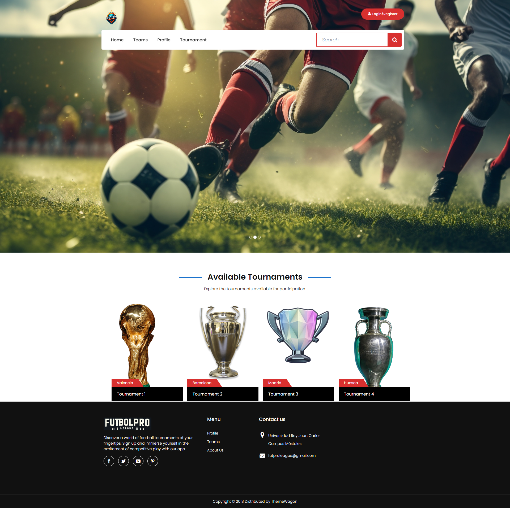

___

## Register/Login:
The login/sign up page of the website allows users to access or create their account on your website. It features the following elements:

A logo at the top corner, consisting of multiple colors and shapes, representing the identity of your website.
A login box in the center, with options to enter email and password. The login box has two tabs labeled “Log In” and “Sign Up,” indicating that users can either log into their existing account or create a new one. There is a red “LOGIN” button below the email and password fields for users to proceed after entering their credentials. There is also a link labeled “Forgot your password?” for users who need to recover their password.

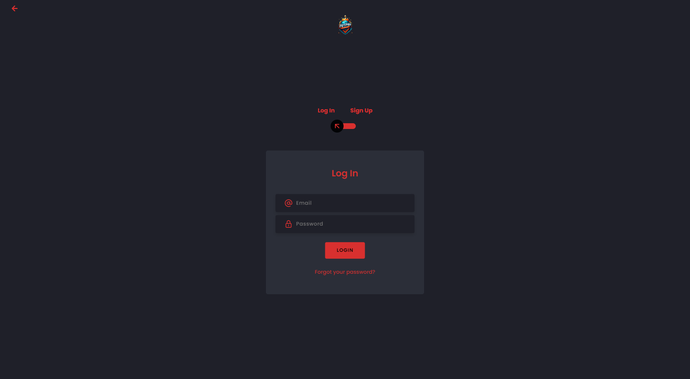

___

## Tournament Bracket:
The tournament bracket page website displays the matches and results of a football tournament. It features the following elements:

A blank tournament bracket in the middle, labeled ROUND 1 through FINAL; each section has blank spaces for team names and scores. The bracket is designed for a single-elimination tournament with 16 teams.
A stadistics button below the bracket, which allows users see the stadistics off the tournament.

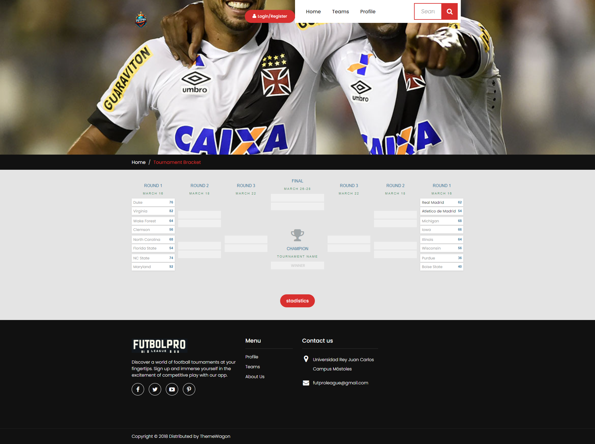

___

## Match Screen:
The Match Screen of the web page displays detailed information about a specific football match between two teams. It provides a clear and organized layout that allows users to quickly grasp the key details of the match.
The Match Screen consists of the following elements:

Team logos displayed prominently.
A white box containing lists of players from both teams, divided into two columns labeled with each team’s name. Each column lists players’ names under their respective teams.
A button labeled “Match Report” located below the white box, which leads to a page with more details and statistics about the match.


___

## Statistics:
The Statistics Page of the web page shows four bar graphs with different statistics about the football matches. It provides a simple and visual way to compare the performance of the teams and players.

The Statistics Page consists of: 

Four graphs for the following statistics: goals, shots, passes, and fouls.


___

## View Player:
The Player Info is a section where users can input information about a football player of their choice.

- The club logo is visible in the top right corner.
- A large image of a stadium filled with spectators serves as the background at the upper part of the webpage. The UEFA Champions League trophy is prominently displayed on this background.
- In front of this background, there's an empty form titled “PLAYER INFO” with various fields like “Name,” “Nationality,” “Age,” etc., for inputting information about a player.
  
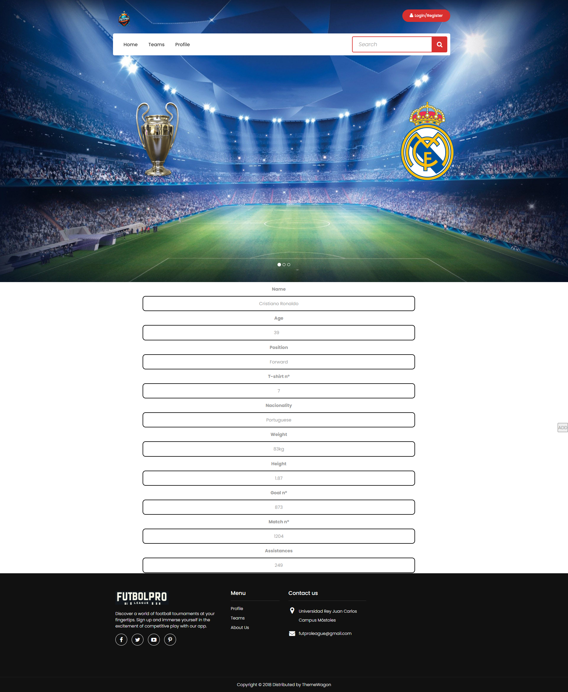

___

## Create New Player:

The create new player section is a section where the user can enter information about a soccer player he wants to add to his team.

- The form fields include spaces to enter the player's name, age, position, team, nationality, height, weight and number. Each field is delineated and has placeholder text indicating what information to enter.
- Below the form is a red button labeled "ADD" to submit the completed form.


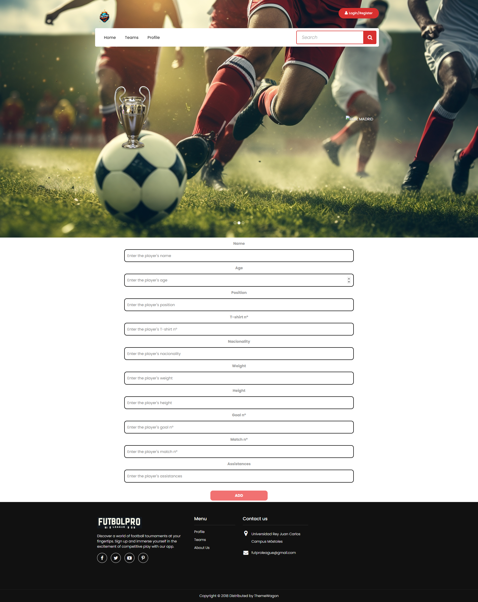

___

## Create New Team:

The create new team section is a section where the user can enter information about a soccer team he wants to create.

- The form has a light gray background and contains several fields to fill in, including:
  - Team Name
  - Players
  - Basic statistics
- There is an orange "Save Changes" button at the bottom of the form to submit the completed information.

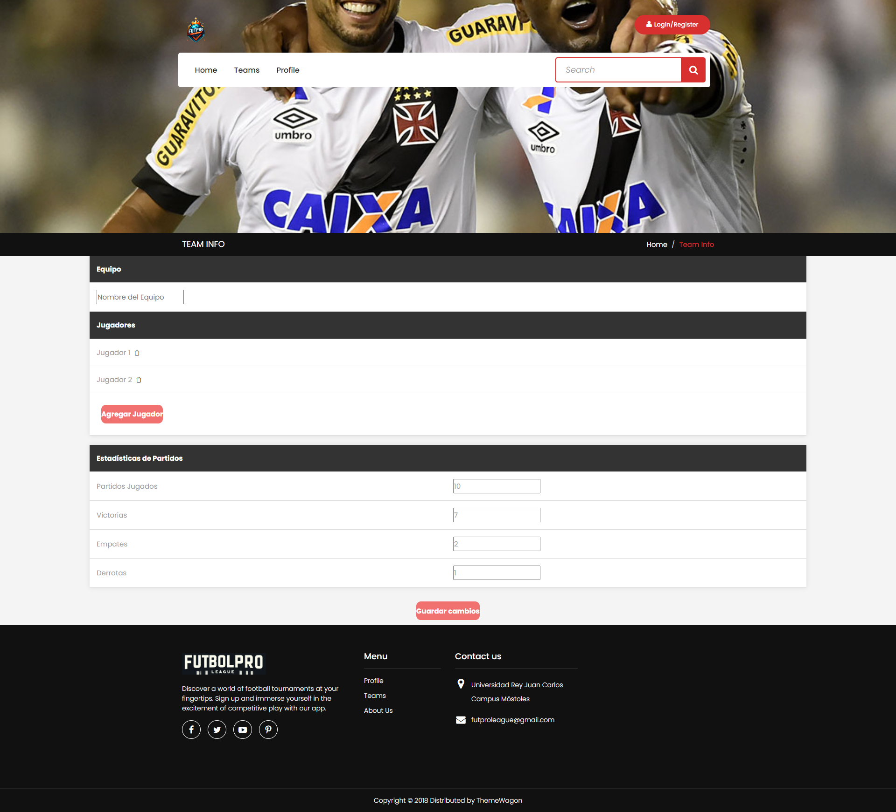

___

## Profile:

The profile section is a section where the user can enter and update personal information.

- The section shows a profile page on a website.
- Below the header is the main content area for user profile information with fields for "First Name*", "Last Name*", "Date of Birth*", "Phone Number*", "Email Address*" and "Address".
- Each field has an empty text box next to it for entering information.
- There is a red button labeled "Save changes" below the input fields.

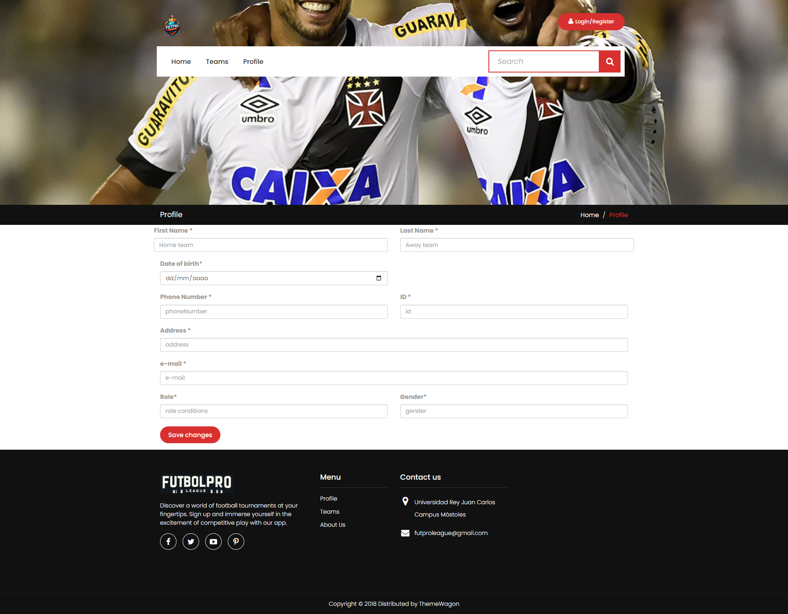

___

## About Us:
The About Us is a section where users can learn more about the FUTBOLPRO League platform and its features.

- In the middle section, there is an article or blog post titled “FutPro League” accompanied by an image. The article explains what FUTBOLPRO LEAGUE is and how it helps users manage their football leagues in minutes.
- Below this section, there’s another part titled “Our Testimonials” featuring a quote from someone praising the website/platform.
  
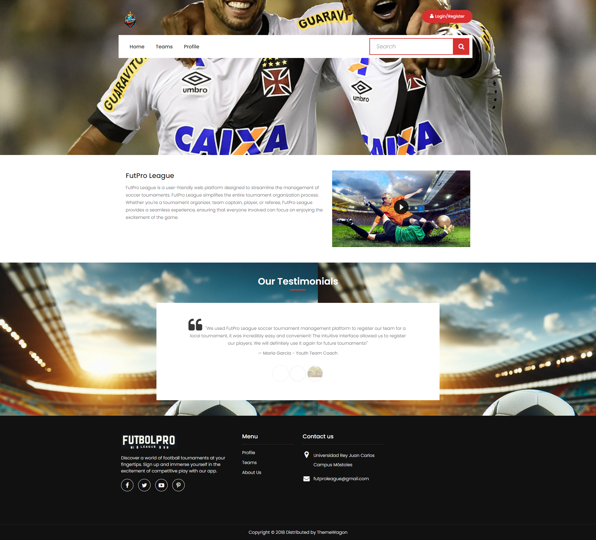

___

## Team:
The Team is a section where users can view information about different football teams.

- All the teams registered in the web.
- The names of the teams and the city that came form are written below their respective logos.

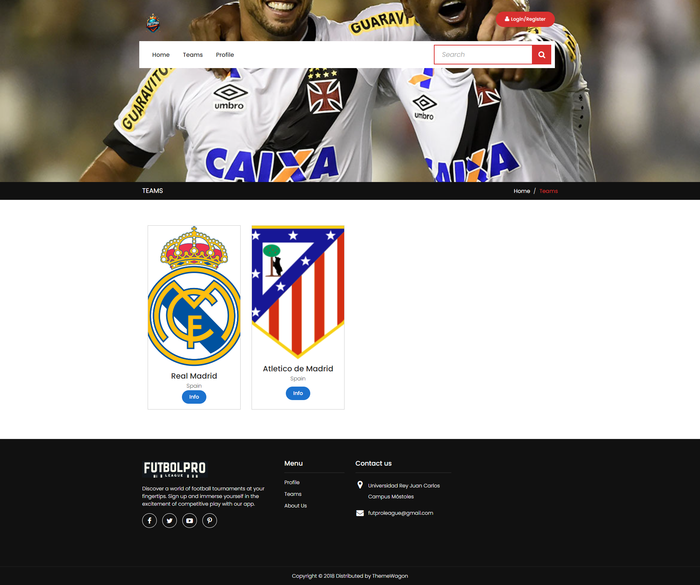

___

## Team Info:
The Team Info is a section where users can view information about a specific football team.

- All the players registered in the team.
- Statistics off that football team.

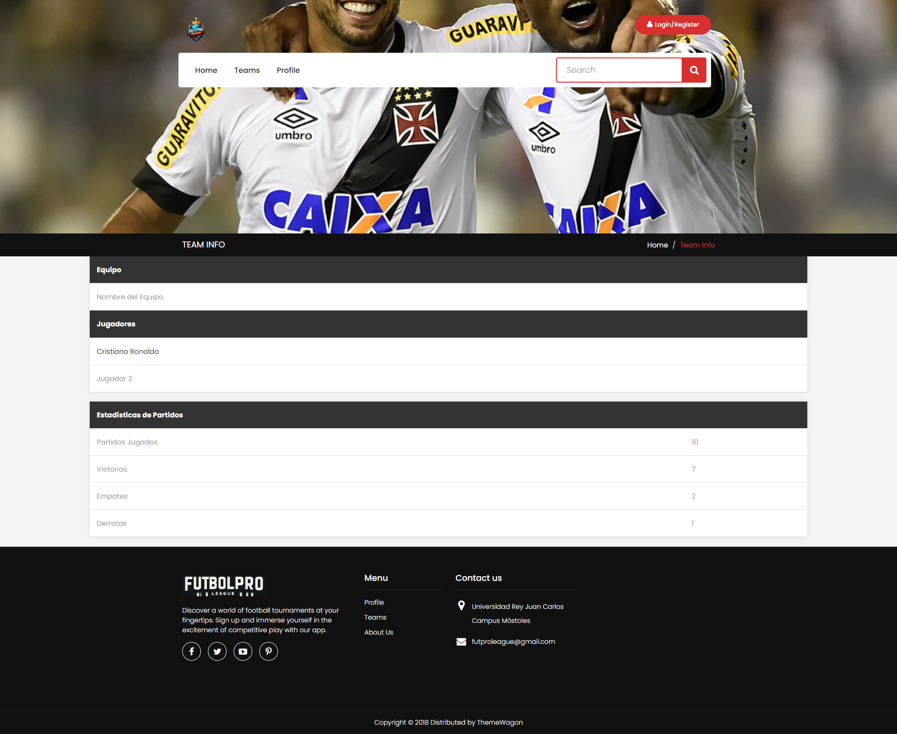

___

## Fill Match Report:
The section for filling out the match report is a section in which the soccer referee can enter information about the match he/she has refereed.

- The section displays an online form entitled "Soccer Referee Report".
- The form has a light gray background and contains several fields to fill in, including:
  - Date of the match
  - Time of the match
  - Home team
  - Away team
  - Stadium
  - Weather conditions
  - Temperature (°F)
  - Match Referees
  - Match Summary
- Each field has a blank space next to it to enter the information.
- There is a red "SEND REPORT" button at the bottom of the form to send the completed report.

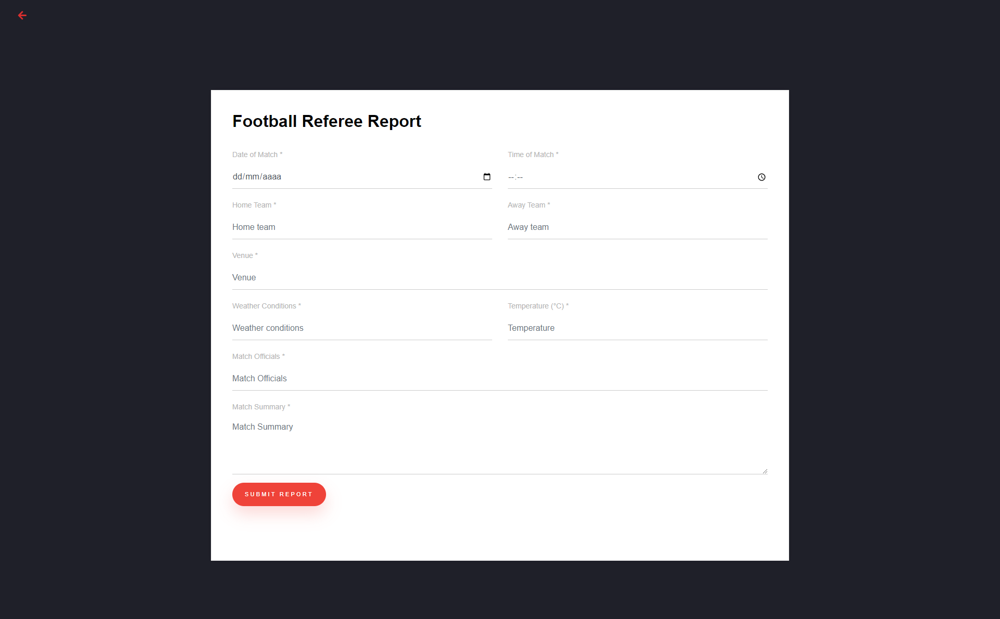

___

## Tournament Create:

The create new tournament section is a section where the user can enter information about a soccer tournament he/she wants to organize.

- The section shows a user interface for creating a new tournament on a website or application.
- Below this header, there is a form with fields to enter:
    - "Tournament name"
    - "Category"
    - "Cup" with an example text "FIFA 20 Tournament cup".
    - Fields to enter different teams labeled "Team 1", "Team 2", "Team 3"...
- At the bottom of the form there are two buttons: a green one labeled "SAVE" and a red one labeled "CANCEL".

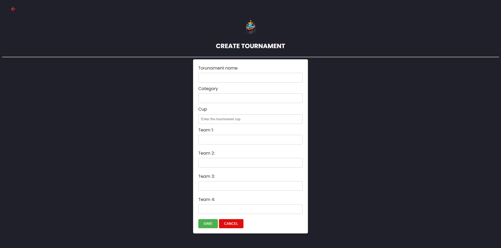

___
# :diamonds: Flow Diagram:

The diagram is a flow chart showing user permissions and navigation steps within a web interface. The diagram uses colored arrows to indicate the progression from one web page or state to another, based on user actions or permissions.

- The diagram is a complex schematic with multiple screenshots of web pages connected by colored arrows indicating different user actions or states.
- Each screenshot represents different sections or pages of a sports or tournament related website.
- There are three initial states at the top: "Registered User", "Guest", "Referee" and "Admin", leading to different paths depending on the user's status.
- Arrows connect these initial states to various web pages, including "Tournament Create", "Events" and "Player/Team Login" among others.
- Each colored arrow represents a user, and therefore the path through which he/she can navigate the site.


___
# Phase 2
___
#  :computer: New Screens
___
## Home Page:
The main page is dedicated to football, showcasing a vibrant and dynamic design. It features the following elements:

A navigation bar at the top with options for “Home,” “Teams,” “Players,” and “Profile.” There is also a search bar and a sign in/register button on the right side.
All available tournaments are shown below along with two buttons for players statistics and teams statistics.
A footer menu at the bottom, including options like “Menu”, "Profile", "Teams", "Players", “About us,” social media profiles, an email contact option, and some information about the website creator and the copyright.

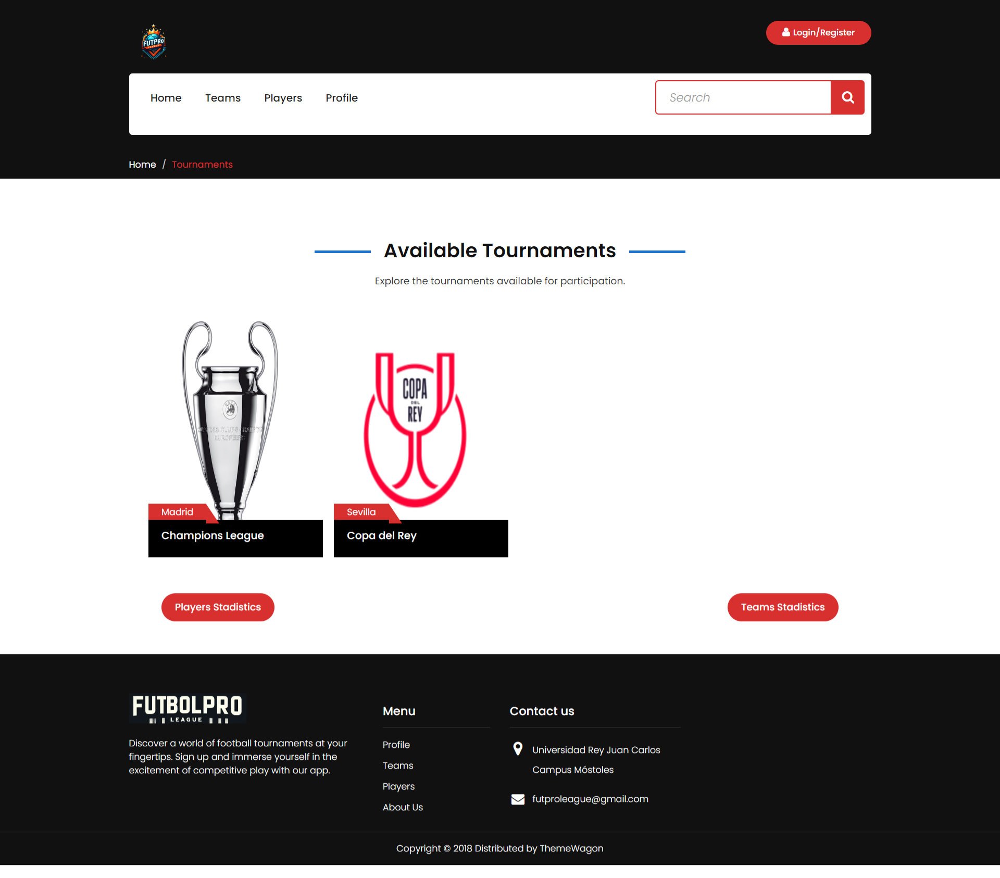

___

## Register/Login:
The login/sign up page of the website allows users to access or create their account on your website. It features the following elements:

A logo at the top, consisting of multiple colors and shapes, representing the identity of our website.
A login box in the center, with options to enter email and password. The login box has two tabs labeled “Log In” and “Sign Up,” indicating that users can either log into their existing account or create a new one. There is a red “LOGIN” button below the email and password fields for users to proceed after entering their credentials. There is also a link labeled “Forgot your password?” for users who need to recover their password.

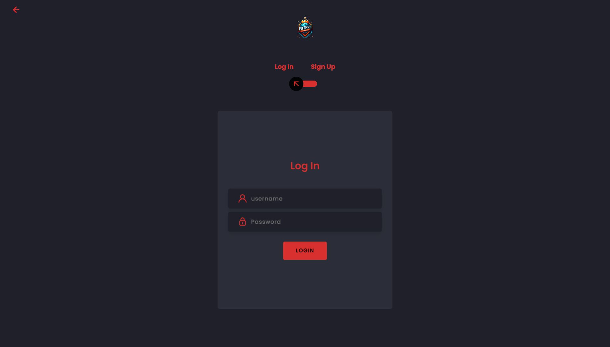

___

## Login Error:
The login error page is to indicate login error. 

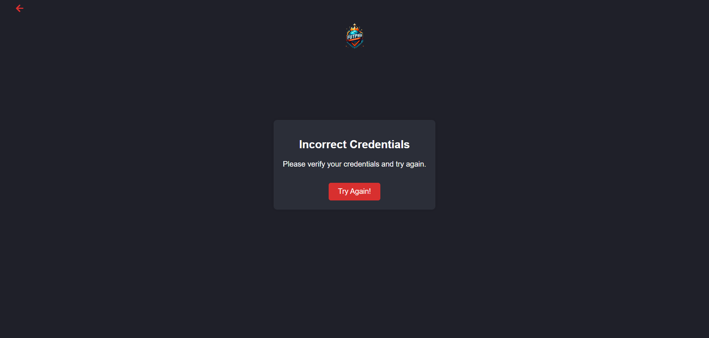

___

## Tournament Bracket:
The tournament bracket page website displays the matches and results of a football tournament. It features the following elements:

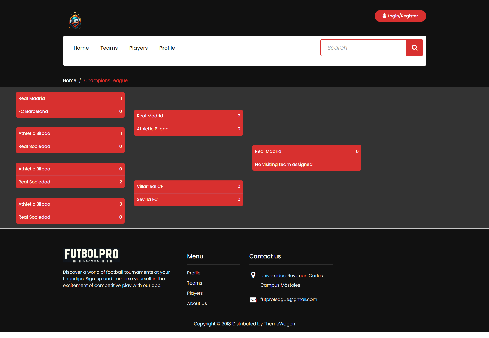

___

## Match Screen:
The Match Screen of the web page displays detailed information about a specific football match between two teams. It provides a clear and organized layout that allows users to quickly grasp the key details of the match.
The Match Screen consists of the following elements:

Team logos displayed prominently.
A white box containing lists of players from both teams, divided into two columns labeled with each team’s name. Each column lists players’ names under their respective teams with an info button to access to the information about the players.
A button labeled “Fill Match Report” located at the bottom, which leads to a page to write information about the match results.
A button labeled “Report” located at the bottom, which leads to a page with more details and statistics about the match.

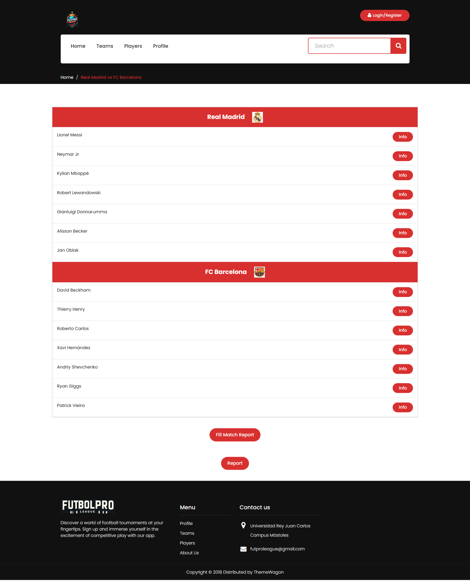

___

## Player Statistics:
The Player Statistics Page shows the players with the most goals.

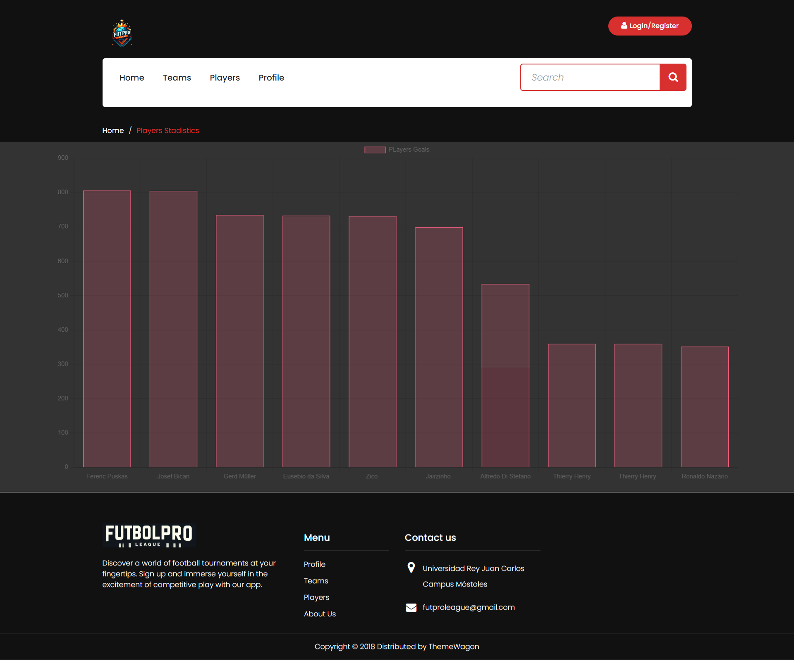

___

## Team Statistics:
The Team Statistics Page shows the teams with the most wins.

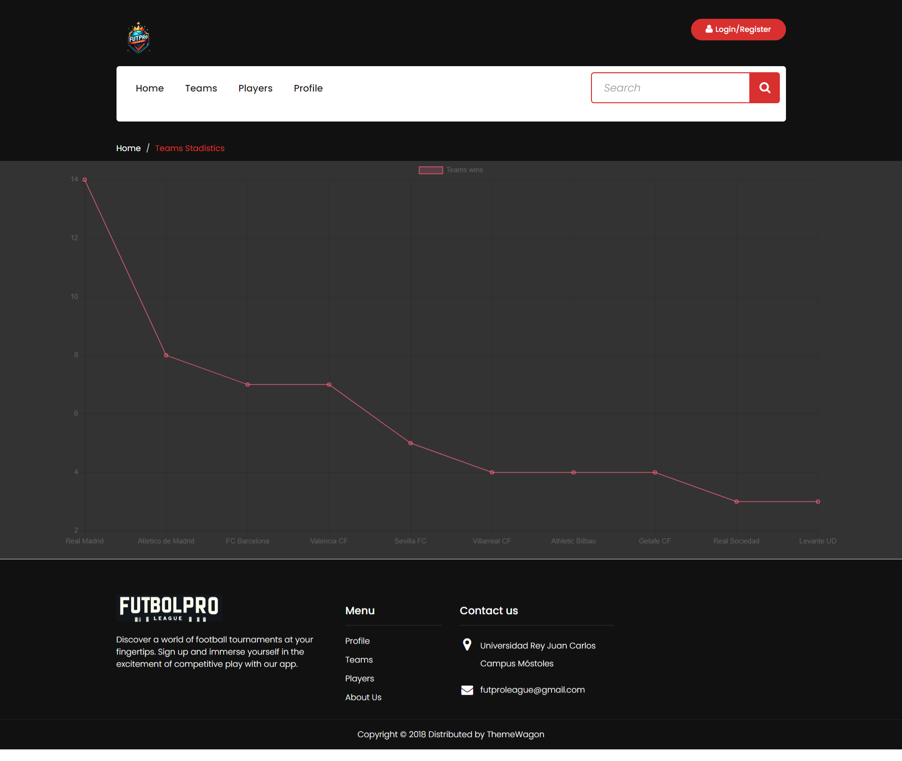


___

## Players:
The Players Page is a section where users can view information about different football players.

- All the players in the different teams.
- The names and lastnames of the players.
- Button for more info.
- Button for see more players.


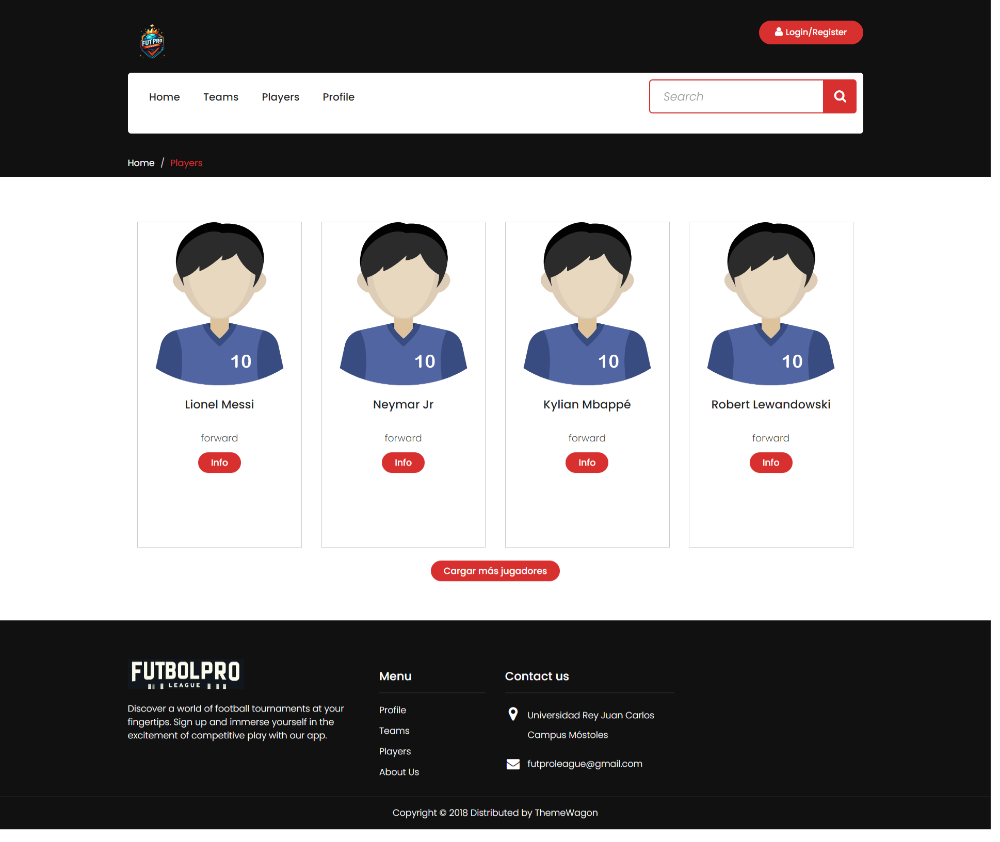

___

## View Player:
The Player Info is a section where users can visualize information about a football player of their choice.

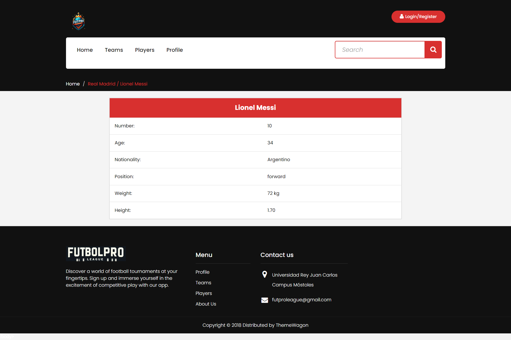

___

## Create New Player:

The create new player section is a section where the user can enter information about a soccer player he wants to add to his team.

- The form fields include spaces to enter the player's name, age, position, team, nationality, height, weight and number. Each field is delineated and has placeholder text indicating what information to enter.
- Below the form is a red button labeled "ADD" to submit the completed form.


___

## Create New Team:

The create new team section is a section where the user can enter information about a soccer team he wants to create.

- The form has a light gray background and contains several fields to fill in, including:
  - Team Name
  - Players
  - Basic statistics


___

## Profile:

The profile section is a section where the user can enter and update personal information.

- The section shows a profile page on a website.
- Below the header is the main content area for user profile information with fields for "First Name*", "Last Name*", "Date of Birth*", "Phone Number*", "Email Address*" and "Address".
- There is a red button labeled "Modify Profile" below the input fields.

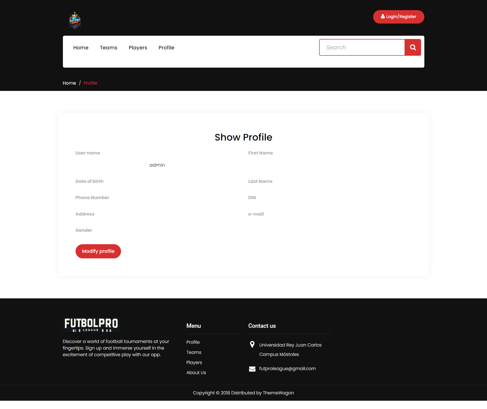


___

## Modify Profile:

The modify profile section is a section where the user can enter and update personal information.

- The section shows a profile page on a website.
- Below the header is the main content area for user profile information with fields for "First Name*", "Last Name*", "Date of Birth*", "Phone Number*", "Email Address*" and "Address".
- There is a red button labeled "Save changes" below the input fields.

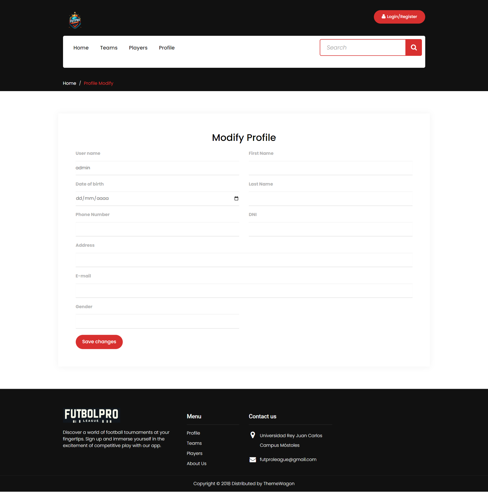

___

## About Us:
The About Us is a section where users can learn more about the FUTBOLPRO  League platform and its features.

- In the middle section, there is an article or blog post titled “FutPro League” accompanied by an image. The article explains what FUTBOLPRO LEAGUE is and how it helps users manage their football leagues in minutes.
- Below this section, there’s another part titled “Our Testimonials” featuring a quote from someone praising the website/platform.

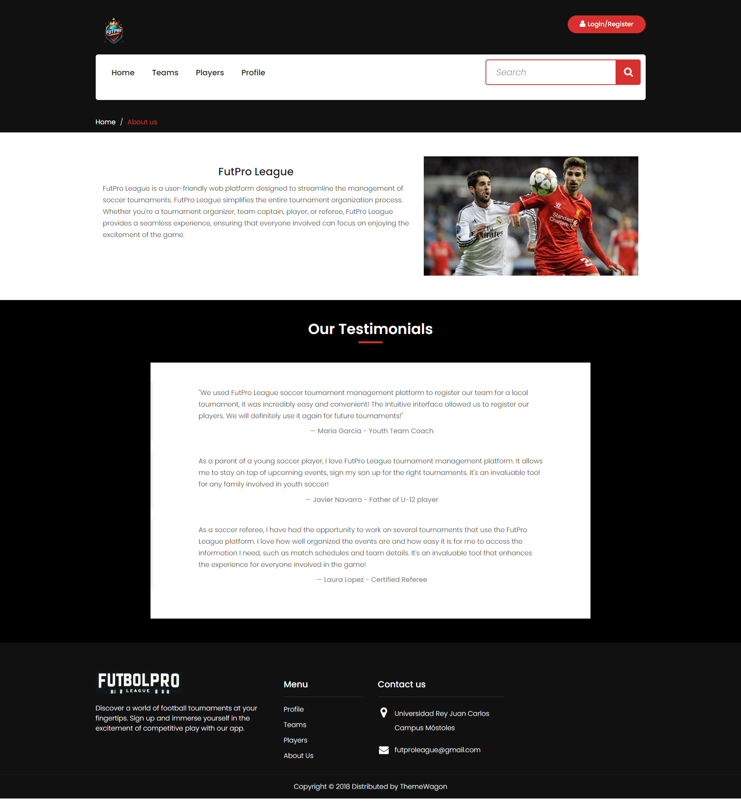

___

## Team:
The Team is a section where users can view information about different football teams.

- All the teams registered in the web.
- The names of the teams and the city that came form are written below their respective logos.
- Red button to visualize more teams.

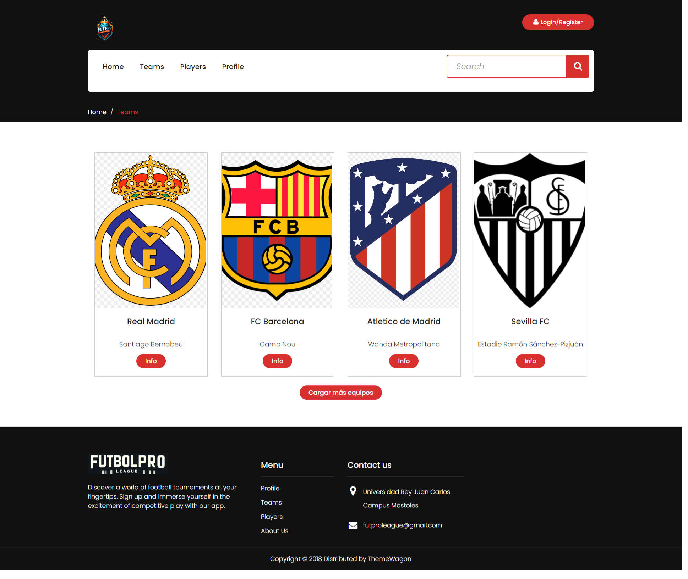

___

## Team Info:
The Team Info is a section where users can view information about a specific football team.

- All the players registered in the team.
- Statistics off that football team.


___

## Fill Match Report:
The section for filling out the match report is a section in which the soccer referee can enter information about the match he/she has refereed.

- The section displays an online form entitled "Soccer Referee Report".
- The form has a light gray background and contains several fields to fill in, including:
  - Date of the match
  - Time of the match
  - Home team
  - Away team
  - Stadium
  - Weather conditions
  - Temperature (°F)
  - Match Referees
  - Match Summary
- Each field has a blank space next to it to enter the information.
- There is a red "SEND REPORT" button at the bottom of the form to send the completed report.


___

## Tournament Create:

The create new tournament section is a section where the user can enter information about a soccer tournament he/she wants to organize.

- The section shows a user interface for creating a new tournament on a website or application.
- Below this header, there is a form with fields to enter:
  - "Tournament name"
  - "Category"
  - "Cup" with an example text "FIFA 20 Tournament cup".
  - Fields to enter different teams labeled "Team 1", "Team 2", "Team 3"...
- At the bottom of the form there are two buttons: a green one labeled "SAVE" and a red one labeled "CANCEL".

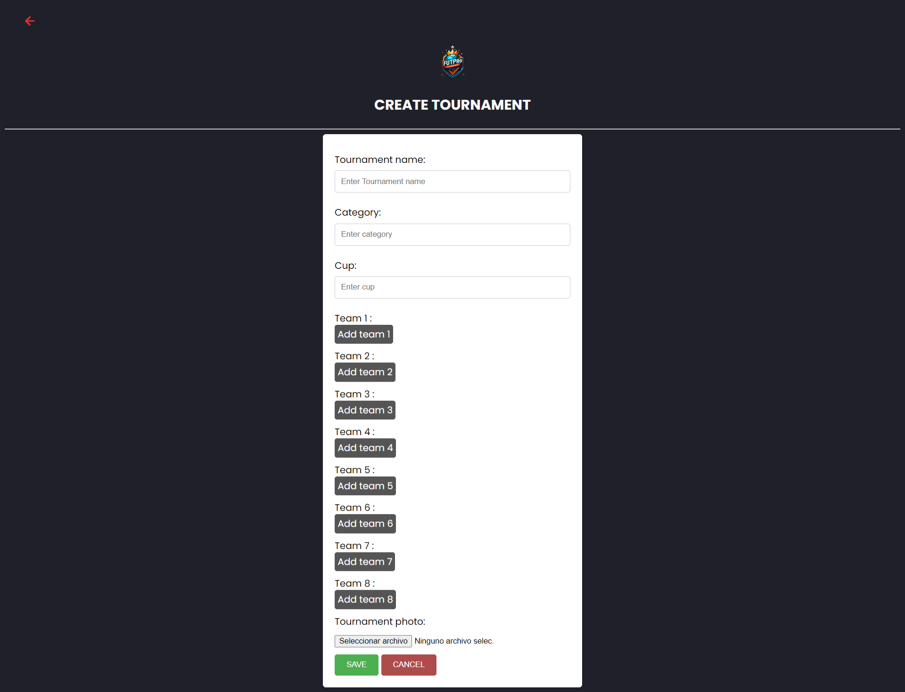

___

## Show Report:

The Show Report page is to show football match reports. 

The page layout includes fields to input details about the match, 
including date, time, teams involved, and match officials. There are also options to display the bracket or download the report as a PDF.

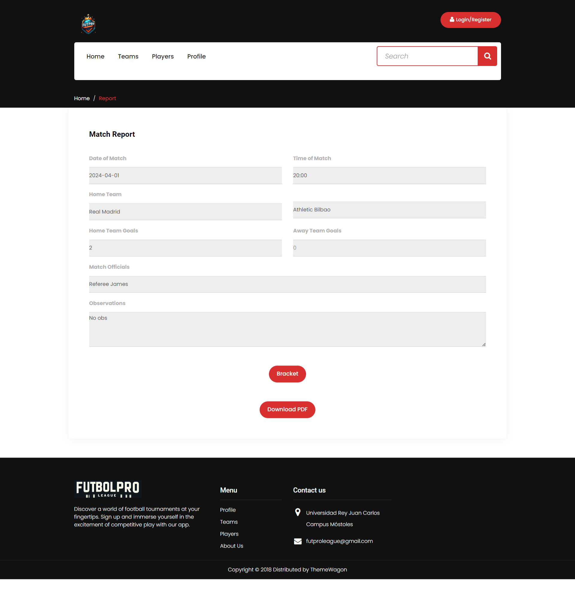

___

# :diamonds: New Flow Diagram:

The diagram is a flow chart showing user permissions and navigation steps within a web interface. The diagram uses colored arrows to indicate the progression from one web page or state to another, based on user actions or permissions.

- The diagram is a complex schematic with multiple screenshots of web pages connected by colored arrows indicating different user actions or states.
- Each screenshot represents different sections or pages of a sports or tournament related website.
- There are three initial states at the top: "Registered User", "Guest", "Referee" and "Admin", leading to different paths depending on the user's status.
- Arrows connect these initial states to various web pages, including "Tournament Create", "Events" and "Player/Team Login" among others.
- Each colored arrow represents a user, and therefore the path through which he/she can navigate the site.

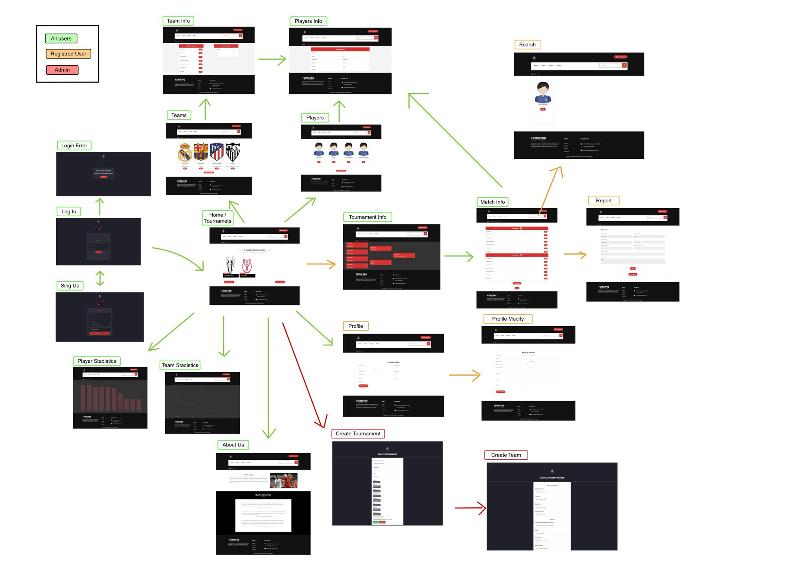


---

# :rocket: Execution Instructions

##  Steps
1. **Download the Repository**


2. **Check Requirements:**
  - Java JDK 19
  - MySQL v.8.0.36.0
  - Maven 4.0.0
  - Spring Boot 3.2.2
  - Integrated Development Environment (IDE) - IntelliJ IDEA recommended

3. **Configure Database:**
  - Download MySQL v.8.0.36.0
  - Select default port (port 3306)
  - Create a user with name root "root" and password "webapp16" with DB admin as user role
  - Configure MySQL Server as Windows Service
  - Grant full access to the user

4. **Docker Configuration:**
- Download Docker desktop. 
- Execute in terminal:
  - docker run -d --name futProLeagueBD -p 3306:3306 -e MYSQL_ROOT_PASSWORD=webapp16 -e MYSQL_DATABASE=futProLeague mysql:latest
  - docker exec -it futProLeagueBD bash

5. **Configure IDE:**
  - Install IntelliJ IDEA (or your preferred IDE).
  - Install Maven and Spring plugins for your IDE.

6. **Run Application in the IDE:**
  - Open the project in your IDE.
  - Build the project using Maven.
  - Run the application.

7. **Access the Application:**
  - Visit https://localhost:8443 in your web browser.

--- 
# :file_folder: Diagram with the database entities

Next, a diagram will be included depicting the entities within the database, their respective fields, and the relationships among them. 


# :art: Class diagram and templates
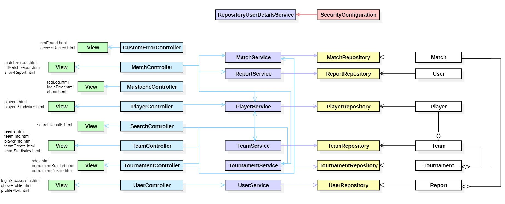
---
# :raised_hand: Participation

---

#### Ahmad Abdel Raziq Al Otaibi

*  I have created different screens with mustache.
*  I have helped to make the different pages more dynamic.
*  I've been in charge of all the AJAX page layout.


| #   |                                                              Commit                                                               |     | #   |                                                                                                File                                                                                                |
| :-: |:---------------------------------------------------------------------------------------------------------------------------------:| :-: | :-: |:--------------------------------------------------------------------------------------------------------------------------------------------------------------------------------------------------:|
| 1º  |  [Add: Show player whit AJAX](https://github.com/CodeURJC-DAW-2023-24/webapp16/commit/e2feaba0f41753ab1351a5596fb11bded63a745b)   | | 1º |   [TeamController.java](https://github.com/CodeURJC-DAW-2023-24/webapp16/blob/9340b414f5ff7651cb9586e01cd61dd491c9b928/backend/src/main/java/es/codeurjc/backend/controller/TeamControler.java)    |
| 2º  |   [Add: Show teams whit AJAX](https://github.com/CodeURJC-DAW-2023-24/webapp16/commit/a31df930fc246c4a22125624924b0417c8b05ed6)   | |2º | [PlayerController.java](https://github.com/CodeURJC-DAW-2023-24/webapp16/blob/9340b414f5ff7651cb9586e01cd61dd491c9b928/backend/src/main/java/es/codeurjc/backend/controller/PlayerController.java) |
| 3º  |        [Add: Pagination](https://github.com/CodeURJC-DAW-2023-24/webapp16/commit/8f5ccfcf9f9d2d5225658111e143ae8ec8f6529f)        | | 3º | [SearchController.java](https://github.com/CodeURJC-DAW-2023-24/webapp16/blob/9340b414f5ff7651cb9586e01cd61dd491c9b928/backend/src/main/java/es/codeurjc/backend/controller/SearchController.java) |
| 4º  | [Add: Templates with Mustaches](https://github.com/CodeURJC-DAW-2023-24/webapp16/commit/d6a39cc16a2119168f7401610f65090913a826ad) | | 4º |             [playersScripts.js](https://github.com/CodeURJC-DAW-2023-24/webapp16/blob/9340b414f5ff7651cb9586e01cd61dd491c9b928/backend/src/main/resources/static/js/playersScript.js)              |
| 5º  |     [Fix: Fixing templates](https://github.com/CodeURJC-DAW-2023-24/webapp16/commit/8f5ccfcf9f9d2d5225658111e143ae8ec8f6529f)     | | 5º |                          [scripts.js](https://github.com/CodeURJC-DAW-2023-24/webapp16/blob/9340b414f5ff7651cb9586e01cd61dd491c9b928/backend/src/main/resources/static/js/script.js)                          |


#### Nicolás Hernández Tejero

*  Developed screens for showTeams and showInfo, including a search bar with filters.
*  Gathered and modified information from the user profiles.
*  Implemented tournament functionality, including the creation of matches, deciding winners, and updating data accordingly.
*  Designed statistical graphics to visualize data trends.
*  Generated reports and match results calculated through reporting mechanisms.

| #   |                                                               Commit                                                               |     | #   |                                                                                  File                                                                                   |
| :-: |:----------------------------------------------------------------------------------------------------------------------------------:| :-: | :-: |:-----------------------------------------------------------------------------------------------------------------------------------------------------------------------:|
| 1º  |         [Add: tournament working!!!](https://github.com/CodeURJC-DAW-2023-24/webapp16/commit/8f521f1bb3588cf58f0755dc41c4bdbbce8e0997)          | | 1º |      [MatchController.java](https://github.com/CodeURJC-DAW-2023-24/webapp16/blob/main/backend/src/main/java/es/codeurjc/backend/webController/MatchWebController.java)       |
| 2º  |         [Fix:bracket issue](https://github.com/CodeURJC-DAW-2023-24/webapp16/commit/ea1b3ad7e76d76963ccb34559af3fca5f0cd838b)         | |2º |    [SearchWebController.java](https://github.com/CodeURJC-DAW-2023-24/webapp16/blob/main/backend/src/main/java/es/codeurjc/backend/webController/SearchWebController.java)    |
| 3º  | [Add: search controller and functionality](https://github.com/CodeURJC-DAW-2023-24/webapp16/commit/54cb1bb2f8be67c53b7002e4b0e6d84fcc8cb779)  | | 3º | [PlayerWebController.java](https://github.com/CodeURJC-DAW-2023-24/webapp16/blob/main/backend/src/main/java/es/codeurjc/backend/webController/PlayerWebController.java) |
| 4º  | [Add: new graphic of players](https://github.com/CodeURJC-DAW-2023-24/webapp16/commit/862a2160e819f628faa80fa4205b5ed11ef9bf85) | | 4º |       [UserController.java](https://github.com/CodeURJC-DAW-2023-24/webapp16/blob/main/backend/src/main/java/es/codeurjc/backend/webController/UserWebController.java)        |
| 5º  |        [Add: new option off filters in the search bar](https://github.com/CodeURJC-DAW-2023-24/webapp16/commit/6ec37310609d0d5c48e3ee2277845550c5e92661)        | | 5º |        [TeamController.java](https://github.com/CodeURJC-DAW-2023-24/webapp16/blob/main/backend/src/main/java/es/codeurjc/backend/webController/TeamWebController.java)        |

#### Adrián Soriano Aragón

* I have implemented the security part and https.
* I have been in charge of managing the users' session
* I have implemented the technology to be able to download a match report in PDF format.
* I have done the redirect to an error page when a status error occurs
* I have implemented some methods to be able to convert URL to actual images in the view.


| #   |                                                               Commit                                                                |     | #   |                                                                                  File                                                                                   |
| :-: |:-----------------------------------------------------------------------------------------------------------------------------------:| :-: | :-: |:-----------------------------------------------------------------------------------------------------------------------------------------------------------------------:|
| 1º  |        [Add Bracket Logic](https://github.com/CodeURJC-DAW-2023-24/webapp16/commit/3f22816419e1dae61d40bb36a2d3142916efe872)        | | 1º |      [MatchController.java](https://github.com/CodeURJC-DAW-2023-24/webapp16/blob/main/backend/src/main/java/es/codeurjc/backend/controller/MatchController.java)       |
| 2º  |      [Images from Database](https://github.com/CodeURJC-DAW-2023-24/webapp16/commit/0a2e8bb2ecbbca4e859ca909214bf668e6f6e388)       | |2º | [SecurityConfiguration.java](https://github.com/CodeURJC-DAW-2023-24/webapp16/blob/main/backend/src/main/java/es/codeurjc/backend/security/SecurityConfiguration.java)  |
| 3º  |            [Add Https](https://github.com/CodeURJC-DAW-2023-24/webapp16/commit/fe8000c240dddf4419abd5947fd6fc1e73a2dfdf)            | | 3º |       [UserController.java](https://github.com/CodeURJC-DAW-2023-24/webapp16/blob/main/backend/src/main/java/es/codeurjc/backend/controller/UserController.java)        |
| 4º  | [Add Security and Authentication](https://github.com/CodeURJC-DAW-2023-24/webapp16/commit/29c97b5da3c281cd068b792ce3cd9e71a7bd6d70) | | 4º | [CustomErrorControler.java](https://github.com/CodeURJC-DAW-2023-24/webapp16/blob/main/backend/src/main/java/es/codeurjc/backend/controller/CustomErrorController.java) |
| 5º  |       [Add PDF Technology](https://github.com/CodeURJC-DAW-2023-24/webapp16/commit/c1396b2143030c307e52e3a883b12359372d2306)        | | 5º | [TournamentController.java](https://github.com/CodeURJC-DAW-2023-24/webapp16/blob/main/backend/src/main/java/es/codeurjc/backend/controller/TournamentController.java)  |

#### Manuel López Corchado

* Added entities for database and database set up
* Created bracket for tournaments
* Designed html form to fulfill a tournament
* Designed html form to fulfill a team
* Added logic to collect text data from form
* Added logic to collect images from user files.


| #   |                                                                              Commit                                                                               |     | #   |                                                                                              File                                                                                               |
| :-: |:-----------------------------------------------------------------------------------------------------------------------------------------------------------------:| :-: | :-: |:-----------------------------------------------------------------------------------------------------------------------------------------------------------------------------------------------:|
| 1º  |   [Add Tournament - Team - Player html, Java and SQL config](https://github.com/CodeURJC-DAW-2023-24/webapp16/commit/353810e6c85d7305d016445d7e7b3da8c82c24ed)    | | 1º |                    [TeamController.java](https://github.com/CodeURJC-DAW-2023-24/webapp16/blob/main/backend/src/main/java/es/codeurjc/backend/controller/TeamControler.java)                    |
| 2º  |         [Models added to proyect and DB configuration](https://github.com/CodeURJC-DAW-2023-24/webapp16/commit/514c5de469c2c3a0177d1f6fdc8fd75c07a7a15d)          | |2º |             [TournamentController.java](https://github.com/CodeURJC-DAW-2023-24/webapp16/blob/main/backend/src/main/java/es/codeurjc/backend/controller/TournamentController.java)              |
| 3º  | [Add photo to team and tournament, fixed error in player names](https://github.com/CodeURJC-DAW-2023-24/webapp16/commit/9340b414f5ff7651cb9586e01cd61dd491c9b928) | | 3º |       [UserController.java](https://github.com/CodeURJC-DAW-2023-24/webapp16/blob/main/backend/src/main/java/es/codeurjc/backend/controller/UserController.java)        |
| 4º  |    [CSS - Bracket Style done and migration success complete](https://github.com/CodeURJC-DAW-2023-24/webapp16/commit/28f1338a14476accf8ba0a076e926649547cebfc)    | | 4º |           [MatchController.java](https://github.com/CodeURJC-DAW-2023-24/webapp16/blob/main/backend/src/main/java/es/codeurjc/backend/controller/MatchController.java)            |
| 5º  |           [Add tournament saving and adjusting links](https://github.com/CodeURJC-DAW-2023-24/webapp16/commit/94bc64d9798d3d1ea52010c28e9718c999cab131)           | | 5º | [teamCreate.html](https://github.com/CodeURJC-DAW-2023-24/webapp16/blob/main/backend/src/main/resources/templates/teamCreate.html)  |


#### Natalia Hernández Vargas

* I have done the error templates.
* I have done the Navegation Diagram.
* I have update de Mustache Controller.


| #   |                                                              Commit                                                              |     | #   |                                                                                  File                                                                                  |
| :-: |:--------------------------------------------------------------------------------------------------------------------------------:| :-: | :-: |:----------------------------------------------------------------------------------------------------------------------------------------------------------------------:|
| 1º  |     [Create Team Template](https://github.com/CodeURJC-DAW-2023-24/webapp16/commit/f4d902eaf249610410e219dd2af1dacf2b53fc86)     | | 1º |   [MustacheController.java](https://github.com/CodeURJC-DAW-2023-24/webapp16/blob/main/backend/src/main/java/es/codeurjc/backend/controller/MustacheControler.java)    |
| 2º  |   [Create New Team Players](https://github.com/CodeURJC-DAW-2023-24/webapp16/commit/fea7e1b426d828555dc697b85291d2ad3beb302f)    | |2º | [SecurityConfiguration.java](https://github.com/CodeURJC-DAW-2023-24/webapp16/blob/main/backend/src/main/java/es/codeurjc/backend/security/SecurityConfiguration.java) |
| 3º  |  [Update Mustache Controller](https://github.com/CodeURJC-DAW-2023-24/webapp16/commit/22249564fc6f3fc2debc2acc0c680f9274c85206)  | | 3º |                     [notFound.html](https://github.com/CodeURJC-DAW-2023-24/webapp16/blob/main/backend/src/main/resources/templates/notFound.html)                     |
| 4º  | [Create Error Pages Templates](https://github.com/CodeURJC-DAW-2023-24/webapp16/commit/925e9a1510596fc1df70f8af182567d9068b74ff) | | 4º |             [tournamentCreate.html](https://github.com/CodeURJC-DAW-2023-24/webapp16/blob/main/backend/src/main/resources/templates/tournamentCreate.html)             |
| 5º  |      [Navegation Diagram](https://github.com/CodeURJC-DAW-2023-24/webapp16/commit/925e9a1510596fc1df70f8af182567d9068b74ff)      | | 5º |                   [teamCreate.java](https://github.com/CodeURJC-DAW-2023-24/webapp16/blob/main/backend/src/main/resources/templates/teamCreate.html)                   |


___
# Phase 3
___
# 🌐 API REST documentation
The REST API documentation is automatically generated and can be accessed in the following formats:

- **OpenAPI Specification (YAML):** [api-docs.yaml](backend/api-docs/api-docs.yaml)
- **HTML Documentation (Viewable in browser):** [api-docs.html](backend/api-docs/api-docs.html)

To generate or update this documentation, follow these commands:

1. Change to the directory containing the `pom.xml` file:
   ```shell
   cd backend

2. Then, use the command to generate or update the documentation:
   ```shell
   mvn verify

---
# :art: Class diagram and templates
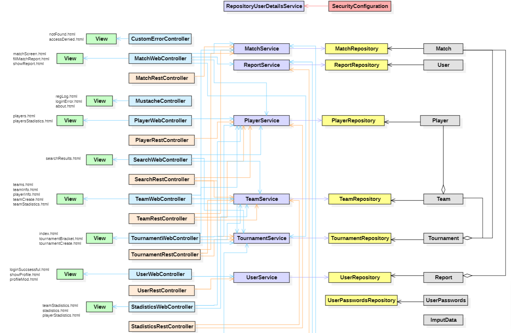

---


# Instructions for Running the Dockerized Application

To run the application using the docker-compose.yml file, follow these instructions:

### Requirements:
- Docker installed on the host machine
- Docker Compose installed on the host machine

### Steps:
1. Clone the repository of the application using Git: 
   ```bash
    git clone https://github.com/CodeURJC-DAW-2023-24/webapp16
   ```
2. Navigate to the directory where the docker-compose.yml file is located.
3. Open a terminal or command prompt.
4. Run the following command to start the application:

   ```bash
    docker-compose up 
   ```
    This command will start the application.


5. Wait for the application to be fully deployed.

### Accessing the Application:
Once the application is ready to be used, you can access it through a web browser using the following URL:

  ```plaintext
   http://localhost:8443
   ```

---
# Documentation for Building the Docker Image

To build the dockerized image of the application, follow these instructions:

### Requirements:
- Docker installed on the host machine

### Steps:
1. Clone the repository of the application using Git: 

   ```bash
    git clone https://github.com/CodeURJC-DAW-2023-24/webapp16
   ```
2. Navigate to the docker directory of the application.
3. Open a terminal or command prompt.
4. Execute the following command to build docker image and push it to your repository to publish the image:

  ```bash
    ./create_image.ps1 
   ```
  :exclamation: :exclamation: You will have to modify the username to your docker username to run it. This script will publish the docker image.

5. Wait for the docker image to be built.

---

# Deployment on Virtual Machine 
## Requirements
* Operating system: Ubuntu 22.04 
* Provided Private Key : 'prAppWeb16.key'
* Active internet connection to Eduroam 

## Steps 

1. **Ssh connection**

   Connect to the virtual machine using SSH with the provided private key.

    ``` bash 
    ssh -i prAppWeb16.key vmuser@10.100.139.173
    ``` 
2. **Docker and Docker Compose Installation**

   Install Docker and Docker Compose on the virtual machine following the official instructions:

  - Docker: [Installation instructions for Ubuntu](https://docs.docker.com/engine/install/ubuntu/)
  - Docker Compose: [Installation instructions](https://docs.docker.com/compose/install/)

3. **Repository Cloning**

   Clone the application repository using Git.

   ```bash
   git clone https://github.com/CodeURJC-DAW-2023-24/webapp16
   ```

4. **Application Execution**

   Run the application using the `docker-compose.yml` file. Add the `-d` option to run in the background.

   ```bash
   cd webapp16/docker
   sudo docker compose up -d
   ```

5. **Accessing the Application**

   Once the application is running, you can access it from a web browser using the virtual machine's IP address and port 8443.

   ```plaintext
   https://10.100.139.173:8443
   ```


These steps will guide you through the process of deploying the application on the provided virtual machine. Make sure to follow each step carefully to ensure a successful deployment.


---

# Deployed application URL
  The application can be accessed at the following URL:
   ```plaintext
   https://10.100.139.173:8443
   ```
## User Examples 
Below are the credentials for example users, including an administrator user, to test the application:


| User Type    | :construction_worker: Username | :lock: Password |
|--------------|--------------------------------|-----------------|
| Administrator| admin                          | adminpass       |
| Regular User | user                           | pass            |


---
# :raised_hand: Participation

---

#### Ahmad Abdel Raziq Al Otaibi

*  I created some DTOs needed to show the elements on the API's requests.
*  I implemented many Project CRUD Rest functions and Images CRUD Rest functions.
*  I created Postman requests.
*  I documented the Rest controllers using Swagger.
*  I helped generate dynamically the api-docs documentation.


| #   |                                                              Commit                                                               |     | #   |                                                                                                File                                                                                                |
| :-: |:---------------------------------------------------------------------------------------------------------------------------------:| :-: | :-: |:--------------------------------------------------------------------------------------------------------------------------------------------------------------------------------------------------:|
| 1º  |  [Add: REST match getById](https://github.com/CodeURJC-DAW-2023-24/webapp16/commit/4753b90309b084007093a06d5892eae6f5cc4007)   | | 1º |   [MatchDTO.java](backend/src/main/java/es/codeurjc/backend/DTOs/MatchDTO.java)    |
| 2º  |   [Add: Rest Match Post, Put and Delete](https://github.com/CodeURJC-DAW-2023-24/webapp16/commit/ad9c3606325eff2b3a07cf731c79c9e2ef00766f)   | |2º | [MatchRestController.java](backend/src/main/java/es/codeurjc/backend/RESTController/MatchRestController.java) |
| 3º  |        [Update collections Json](https://github.com/CodeURJC-DAW-2023-24/webapp16/commit/d352afcb8c9c1170fa1cb74da1f64c453423deef)        | | 3º | [TournamentRestController.java](backend/src/main/java/es/codeurjc/backend/RESTController/TournamentRestController.java) |
| 4º  | [Add: documentation MatchRestController](https://github.com/CodeURJC-DAW-2023-24/webapp16/commit/502bc571f04e6a7ec8ae3c9943f85c27e440b6ef) | | 4º |             [TeamRestController.java](backend/src/main/java/es/codeurjc/backend/RESTController/TeamRestController.java)              |
| 5º  |     [Add: documentation TournamentRestController](https://github.com/CodeURJC-DAW-2023-24/webapp16/commit/12ee750e57af7ee7a7f87cc72cbe7062df82ab3f)     | | 5º |                          [UserRestController.java](backend/src/main/java/es/codeurjc/backend/RESTController/UserRestController.java)                          |


#### Nicolás Hernández Tejero

*  Dockerization of the Application: I completed the dockerization of the application, ensuring a consistent environment for development and deployment.
*  Implementation of Docker Compose: I added Docker Compose to the project, which allowed us to define and manage multi-container Docker applications.
*  Controller Refactoring: I refactored our controllers, specifically adding ReportWebController and StatisticsWebController, to better organize our code and improve its maintainability.
*  Development of REST APIs: I developed several REST APIs for our application, including those for teams, players, and tournaments also the filter option for each one of then. This included creating, modifying, and deleting resources, as well as fetching resource details.
*  Introduction of Sample Data via Postman: I introduced sample data into our application using Postman. This involved creating a collection of requests, each with its own set of parameters, headers, and body data.
* Refactoring for Code Reusability: As part of my efforts to improve the maintainability and readability of our codebase, I separated the functions for converting images to blobs and determining a user’s role into separate files.
 
| #   |                                                               Commit                                                               |     | #   |                                                                                         File                                                                                          |
| :-: |:----------------------------------------------------------------------------------------------------------------------------------:| :-: | :-: |:-------------------------------------------------------------------------------------------------------------------------------------------------------------------------------------:|
| 1º  |         [Complete: dockerizar app](https://github.com/CodeURJC-DAW-2023-24/webapp16/commit/f3573a8db146fc319af367bc9a6cb735960e45fd)          | | 1º |             [Dockerfile](https://github.com/CodeURJC-DAW-2023-24/webapp16/blob/main/docker/Dockerfile)              |
| 2º  |         [Add: docker Compose](https://github.com/CodeURJC-DAW-2023-24/webapp16/commit/f3573a8db146fc319af367bc9a6cb735960e45fd)         | |2º |            [BlobConverter.java](https://github.com/CodeURJC-DAW-2023-24/webapp16/blob/main/backend/src/main/java/es/codeurjc/backend/utils/BlobConverter.java)             |
| 3º  | [Add: Rest Search get](https://github.com/CodeURJC-DAW-2023-24/webapp16/commit/435c4307cbf54e304d61856e75b83fc5c0b4a3ab)  | | 3º | [PlayerRestController.java](https://github.com/CodeURJC-DAW-2023-24/webapp16/blob/main/backend/src/main/java/es/codeurjc/backend/RESTController/PlayerRestController.java)  |
| 4º  | [Refactor: Add ReportWebController and StatisticsWebController](https://github.com/CodeURJC-DAW-2023-24/webapp16/commit/90641b8f2706538faefda665151c28915bc51671) | | 4º |            [TournamentRestController.java](https://github.com/CodeURJC-DAW-2023-24/webapp16/blob/main/backend/src/main/java/es/codeurjc/backend/RESTController/TournamentRestController.java)             |
| 5º  |        [Add: REST player DELETE PUT POST](https://github.com/CodeURJC-DAW-2023-24/webapp16/commit/bed54deb0428fabb9c2e9f6388a1f204393c4292)        | | 5º | [TeamRestController.java](https://github.com/CodeURJC-DAW-2023-24/webapp16/blob/main/backend/src/main/java/es/codeurjc/backend/RESTController/TeamRestController.java) |

#### Adrián Soriano Aragón

* I have implemented the security part and https.
* I have been in charge of managing the users' session
* I have implemented the technology to be able to download a match report in PDF format.
* I have done the redirect to an error page when a status error occurs
* I have implemented some methods to be able to convert URL to actual images in the view.


| #   |                                                              Commit                                                               |     | #   |                                                                  File                                                                   |
| :-: |:---------------------------------------------------------------------------------------------------------------------------------:| :-: | :-: |:---------------------------------------------------------------------------------------------------------------------------------------:|
| 1º  |       [Add:Open API doc](https://github.com/CodeURJC-DAW-2023-24/webapp16/commit/1e676ae24666f0fdd301378588d2e1890ff29c14)        | | 1º |               [api-docs.yaml](https://github.com/CodeURJC-DAW-2023-24/webapp16/blob/main/backend/api-docs/api-docs.yaml)                |
| 2º  | [Add:Docker and Docker Compose](https://github.com/CodeURJC-DAW-2023-24/webapp16/commit/0cd443aaf663013ae2d1f7d0fba3e13fc332381f) | |2º |                       [Dockerfile](https://github.com/CodeURJC-DAW-2023-24/webapp16/blob/main/docker/Dockerfile)                        |
| 3º  |     [Add: Postman Requests](https://github.com/CodeURJC-DAW-2023-24/webapp16/commit/1a0030507e74e719240c3b46e76487b194034f78)     | | 3º |                   [Docker-compose.yml](https://github.com/CodeURJC-DAW-2023-24/webapp16/blob/main/docker/Dockerfile)                    |
| 4º  |  [Update: Docker-Compose yml](https://github.com/CodeURJC-DAW-2023-24/webapp16/commit/3d85bf30a8d397f08f31741cd9868b9cede82531)   | | 4º | [FutProLeague.postman_collection.json](https://github.com/CodeURJC-DAW-2023-24/webapp16/blob/main/FutProLeague.postman_collection.json) |
| 5º  |   [Update Phase 3 Readme.md](https://github.com/CodeURJC-DAW-2023-24/webapp16/commit/4379f0074f2e07f775c047b7a57ced9aee8192a3)    | | 5º |                            [Readme.md](https://github.com/CodeURJC-DAW-2023-24/webapp16/blob/main/README.md)                            |

#### Manuel López Corchado

* Added entities for database and database set up
* Created bracket for tournaments
* Designed html form to fulfill a tournament
* Designed html form to fulfill a team
* Added logic to collect text data from form
* Added logic to collect images from user files.


| #   |                                                                              Commit                                                                               |     | #   |                                                                                              File                                                                                               |
| :-: |:-----------------------------------------------------------------------------------------------------------------------------------------------------------------:| :-: | :-: |:-----------------------------------------------------------------------------------------------------------------------------------------------------------------------------------------------:|
| 1º  |   [Add Tournament - Team - Player html, Java and SQL config](https://github.com/CodeURJC-DAW-2023-24/webapp16/commit/353810e6c85d7305d016445d7e7b3da8c82c24ed)    | | 1º |                    [TeamController.java](https://github.com/CodeURJC-DAW-2023-24/webapp16/blob/main/backend/src/main/java/es/codeurjc/backend/controller/TeamControler.java)                    |
| 2º  |         [Models added to proyect and DB configuration](https://github.com/CodeURJC-DAW-2023-24/webapp16/commit/514c5de469c2c3a0177d1f6fdc8fd75c07a7a15d)          | |2º |             [TournamentController.java](https://github.com/CodeURJC-DAW-2023-24/webapp16/blob/main/backend/src/main/java/es/codeurjc/backend/controller/TournamentController.java)              |
| 3º  | [Add photo to team and tournament, fixed error in player names](https://github.com/CodeURJC-DAW-2023-24/webapp16/commit/9340b414f5ff7651cb9586e01cd61dd491c9b928) | | 3º |       [UserController.java](https://github.com/CodeURJC-DAW-2023-24/webapp16/blob/main/backend/src/main/java/es/codeurjc/backend/controller/UserController.java)        |
| 4º  |    [CSS - Bracket Style done and migration success complete](https://github.com/CodeURJC-DAW-2023-24/webapp16/commit/28f1338a14476accf8ba0a076e926649547cebfc)    | | 4º |           [MatchController.java](https://github.com/CodeURJC-DAW-2023-24/webapp16/blob/main/backend/src/main/java/es/codeurjc/backend/controller/MatchController.java)            |
| 5º  |           [Add tournament saving and adjusting links](https://github.com/CodeURJC-DAW-2023-24/webapp16/commit/94bc64d9798d3d1ea52010c28e9718c999cab131)           | | 5º | [teamCreate.html](https://github.com/CodeURJC-DAW-2023-24/webapp16/blob/main/backend/src/main/resources/templates/teamCreate.html)  |


#### Natalia Hernández Vargas

* I have implemented the ReportRestController, ReportService and ReportDTO.
* I have done the Class Diagram.
* I have done Postman request.
* I have documented the Rest Controllers using Swagger.
* I have implemented and fixed some Controller and Repository methods.


| #   |                                                                 Commit                                                                  |     | #   |                                                                                    File                                                                                    |
| :-: |:---------------------------------------------------------------------------------------------------------------------------------------:| :-: | :-: |:--------------------------------------------------------------------------------------------------------------------------------------------------------------------------:|
| 1º  |         [Add: ReportService](https://github.com/CodeURJC-DAW-2023-24/webapp16/commit/52713c536a5ff2822e82c7fe0c8feed03a773693)          | | 1º | [ReportRestController.java](https://github.com/CodeURJC-DAW-2023-24/webapp16/blob/main/backend/src/main/java/es/codeurjc/backend/RESTController/ReportRestController.java) |
| 2º  |      [Add: ReportRestController](https://github.com/CodeURJC-DAW-2023-24/webapp16/commit/aa8ad55c9a5548b0963e5ae43d4109f69d8f4383)      | |2º |                 [ReportDTO.java](https://github.com/CodeURJC-DAW-2023-24/webapp16/blob/main/backend/src/main/java/es/codeurjc/backend/DTOs/ReportDTO.java)                 |
| 3º  |  [Update: DTOs, ReportWebController](https://github.com/CodeURJC-DAW-2023-24/webapp16/commit/b75e90182d03c036b1b50ec5cb5872d79ab267f2)  | | 3º |           [ReportService.java](https://github.com/CodeURJC-DAW-2023-24/webapp16/blob/main/backend/src/main/java/es/codeurjc/backend/service/ReportService.java)            |
| 4º  | [Add: documentation Rest Controllers](https://github.com/CodeURJC-DAW-2023-24/webapp16/commit/382b80986944dcbff299b3ec21c89216b157c74d) | | 4º |       [ReportRepository.java](https://github.com/CodeURJC-DAW-2023-24/webapp16/blob/main/backend/src/main/java/es/codeurjc/backend/repository/ReportRepository.java)       |
| 5º  |            [Class Diagram](https://github.com/CodeURJC-DAW-2023-24/webapp16/commit/2033f6db8fdcce00609d4d089db9334af362f222)            | | 5º |                     [Readme.md](https://github.com/CodeURJC-DAW-2023-24/webapp16/blob/main/README.md)                     |

